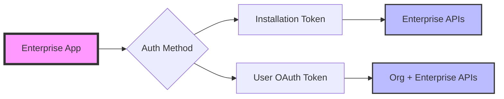

**Greetings, automation ninjas!** 🥷

Remember the days when managing GitHub Apps across hundreds of organizations meant clicking through endless installation screens? Or when you needed a forest of PATs (Personal Access Tokens) to automate enterprise-wide tasks? Well, sharpen your shurikens, because GitHub just dropped a game-changing update that's about to transform how we handle enterprise automation.

Today, we're exploring the newly released [Enterprise-level access for GitHub Apps](https://github.blog/changelog/2025-07-01-enterprise-level-access-for-github-apps-and-installation-automation-apis/), a powerful feature that brings enterprise-grade permissions and installation automation APIs to our arsenal. Let's dive into what this means for your automation dojo!

## 1. The New Era: Enterprise Installations

Until now, GitHub Apps could only be installed at the organization or repository level. This meant that for enterprise-wide automation, you'd need to:
- Install the same app across every organization (click, click, click... 😴)
- Manage separate tokens and rate limits for each installation
- Rely on PATs for enterprise-level operations (security ninjas, you know why this hurts)

### What's Changed?

Enterprise installations introduce a paradigm shift. Apps owned by an enterprise or enterprise-owned organization can now:

- **Request enterprise-level permissions** - A new set of fine-grained permissions specifically for enterprise resources
- **Be installed at the enterprise level** - One installation to rule them all!
- **Automate app installations across organizations** - No more manual clicking marathon

Here's what the new installation flow looks like:


### Key Benefits

| Aspect | Before | After |
|--------|--------|-------|
| **Installation Process** | Manual installation per organization | Single enterprise-level installation |
| **Rate Limits** | Shared across org installations | Dedicated 15,000 requests/hour budget |
| **Token Management** | Multiple tokens for different orgs | Single enterprise token + user OAuth |
| **Automation Scope** | Limited to org boundaries | Enterprise-wide operations |

## 2. The Power Arsenal: New Enterprise Permissions

The real magic lies in the new enterprise permissions. Let's explore each one and see how they can transform your automation workflows.

### 2.1 GitHub App Installation Management

This is the crown jewel for automation enthusiasts. Two new permissions control app installations across your entire enterprise:

- **Enterprise organization installations (read/write)**: The master key for viewing, creating, editing, and removing installations across all organizations
- **Enterprise organization installation repositories (read/write)**: A more focused permission for managing repository access without the ability to install/uninstall apps

#### Real-World Use Case: Automated Security Tool Deployment

Imagine you're rolling out a new security scanning tool across your 200+ organization enterprise:

```javascript
// Pseudo-code for automated app deployment
async function deploySecurityScanner(enterpriseSlug) {
  const organizations = await getEnterpriseOrganizations(enterpriseSlug);
  
  for (const org of organizations) {
    // Check if app already installed
    const installations = await getOrgInstallations(org.login);
    
    if (!installations.find(i => i.app_slug === 'security-scanner')) {
      // Install the app with specific repository access
      await installApp(org.id, {
        app_id: SECURITY_SCANNER_APP_ID,
        repository_selection: 'selected',
        repository_ids: await getCriticalRepos(org.id)
      });
      
      console.log(`✅ Security scanner deployed to ${org.login}`);
    }
  }
}
```

### 2.2 Enterprise SSO and SCIM Management

For enterprises using SAML, OIDC, or SCIM, automation just got a major upgrade:

- **Enterprise single sign-on (read/write)**: Programmatically manage SAML and OIDC configurations
- **Enterprise SCIM (read/write)**: Automate user provisioning for EMU enterprises

#### Real-World Use Case: JIT User Provisioning Pipeline

Here's how you might build a Just-In-Time provisioning system:

```yaml
name: JIT User Provisioning
on:
  workflow_dispatch:
    inputs:
      user_email:
        description: 'User email to provision'
        required: true

jobs:
  provision-user:
    runs-on: ubuntu-latest
    steps:
      - name: Check user in IdP
        id: check-idp
        run: |
          # Query your IdP for user details
          
      - name: Provision via SCIM
        if: steps.check-idp.outputs.user_exists == 'true'
        uses: your-org/scim-provisioning-action@v1
        with:
          enterprise-token: ${{ secrets.ENTERPRISE_APP_TOKEN }}
          user-data: ${{ steps.check-idp.outputs.user_data }}
          
      - name: Assign to teams
        run: |
          # Use the new APIs to assign user to appropriate teams
```

### 2.3 Enterprise People Management

Gone are the days of manual enterprise owner elevation! The new permissions enable:

- Automated user invitations
- Temporary enterprise owner elevation (perfect for break-glass scenarios)
- Bulk user management operations

#### Real-World Use Case: Time-Bound Admin Access

```python
# Elevated access automation
async def grant_temporary_admin(user_login, duration_hours=4):
    """
    Grant temporary enterprise admin access for incident response
    """
    # Elevate user to enterprise owner
    await graphql_mutation("""
        mutation($enterprise_id: ID!, $user_id: ID!) {
            updateEnterpriseAdministratorRole(input: {
                enterpriseId: $enterprise_id,
                login: $user_id,
                role: OWNER
            }) {
                clientMutationId
            }
        }
    """, variables={
        'enterprise_id': ENTERPRISE_ID,
        'user_id': user_login
    })
    
    # Schedule automatic demotion
    await schedule_job(
        job_name=f"demote_{user_login}",
        run_at=datetime.now() + timedelta(hours=duration_hours),
        action="demote_from_owner"
    )
    
    # Send notifications
    await notify_security_team(f"Temporary admin granted to {user_login}")
```

### 2.4 Organization Lifecycle Management

Need to spin up project-specific organizations? The new permissions support:

- **Creating organizations** within your enterprise
- **Removing organizations** when projects end

#### Real-World Use Case: Project-Based Organization Automation

```typescript
interface ProjectConfig {
  name: string;
  duration: number; // in days
  teams: string[];
  repositories: RepositoryTemplate[];
}

async function createProjectEnvironment(config: ProjectConfig) {
  // Create organization for the project
  const org = await createEnterpriseOrganization({
    enterprise: ENTERPRISE_SLUG,
    login: `project-${config.name}`,
    profile_name: `Project: ${config.name}`,
    admin_logins: config.teams.map(t => `${t}-lead`)
  });
  
  // Set up repositories from templates
  for (const template of config.repositories) {
    await createRepoFromTemplate(org.login, template);
  }
  
  // Configure branch protection, secrets, etc.
  await configureOrgSettings(org.login, config);
  
  // Schedule cleanup
  await scheduleOrgCleanup(org.login, config.duration);
}
```

### 2.5 Enterprise Custom Properties

Manage custom repository properties at scale:

```graphql
mutation SetComplianceProperties {
  createOrUpdateEnterpriseCustomProperty(input: {
    enterpriseId: "ENT_ID",
    propertyName: "compliance-level",
    valueType: SINGLE_SELECT,
    defaultValue: "standard",
    allowedValues: ["standard", "high", "critical"],
    description: "Repository compliance classification"
  }) {
    customProperty {
      propertyName
      valueType
    }
  }
}
```

## 3. Practical Implementation Patterns

### Pattern 1: Enterprise-Wide Compliance Automation

Combine multiple permissions for comprehensive compliance:

```javascript
class EnterpriseComplianceAutomation {
  async enforceSecurityBaseline() {
    // 1. Audit all installations
    const installations = await this.auditAllInstallations();
    
    // 2. Install required security apps
    await this.deployRequiredApps([
      'dependabot',
      'code-scanning',
      'secret-scanning'
    ]);
    
    // 3. Configure SSO enforcement
    await this.enforceSSORequirements();
    
    // 4. Set custom properties for tracking
    await this.tagRepositoriesByRisk();
    
    // 5. Generate compliance report
    return this.generateComplianceReport();
  }
}
```

### Pattern 2: Break-Glass Access System

Build a complete emergency access system:

```yaml
# .github/workflows/break-glass-access.yml
name: Break Glass Access Request
on:
  issues:
    types: [labeled]

jobs:
  process-request:
    if: github.event.label.name == 'break-glass-request'
    runs-on: ubuntu-latest
    steps:
      - name: Validate request
        uses: ./actions/validate-emergency
        
      - name: Grant temporary access
        uses: ./actions/enterprise-elevation
        with:
          user: ${{ github.event.issue.user.login }}
          duration: 4h
          
      - name: Configure audit trail
        run: |
          # Log all actions during elevated access period
```

### Pattern 3: Zero-Touch Onboarding

Automate the entire developer onboarding process:

```python
async def onboard_developer(email: str, team: str):
    """Complete developer onboarding automation"""
    
    # 1. Provision user via SCIM
    user = await provision_user_scim(email)
    
    # 2. Add to enterprise
    await invite_enterprise_member(user.id)
    
    # 3. Configure team membership
    await add_to_teams(user.id, [team, 'all-developers'])
    
    # 4. Install personal developer tools
    await install_user_apps(user.id, DEVELOPER_TOOLKIT_APPS)
    
    # 5. Create onboarding issue
    await create_onboarding_checklist(user, team)
    
    return f"Developer {email} onboarded successfully!"
```

## 4. Architecture Considerations

### Authentication Flow

With enterprise installations, you have flexible authentication options:



### Rate Limit Strategy

Enterprise installations get their own generous rate limit budget:

| Installation Type | Requests/Hour | Points/Hour |
|------------------|---------------|-------------|
| Free Org | 5,000 | 5,000 |
| Enterprise Org | 15,000 | 10,000 |
| **Enterprise Installation** | **15,000** | **10,000** |

This separate budget means your enterprise automation won't compete with organization-level operations!

## 5. Migration Strategy

Moving from PATs to Enterprise Apps? Here's a migration checklist:

1. **Audit Current PAT Usage**
   ```bash
   # Find all automation using PATs
   grep -r "ghp_" ./automation/ --include="*.yml" --include="*.yaml"
   ```

2. **Create Enterprise App**
   - Define minimal required permissions
   - Implement proper token rotation

3. **Gradual Migration**
   - Start with read-only operations
   - Move to write operations after validation
   - Keep PATs as fallback initially

4. **Monitor and Optimize**
   - Track API usage patterns
   - Optimize for rate limits
   - Remove PATs once stable

## 6. Security Best Practices

When implementing enterprise apps:

### 🛡️ Principle of Least Privilege
```javascript
// Bad: Request all permissions
const permissions = {
  enterprise_admin: 'write',
  organizations: 'write',
  // ... everything
}

// Good: Request only what's needed
const permissions = {
  enterprise_organization_installations: 'read',
  custom_properties: 'write'
}
```

### 🔐 Token Rotation
Implement automatic token rotation:
```yaml
- name: Rotate Enterprise App Token
  schedule:
    interval: weekly
  steps:
    - rotate-token:
        app-id: ${{ secrets.ENTERPRISE_APP_ID }}
    - update-secret:
        name: ENTERPRISE_APP_TOKEN
```

### 📊 Audit Everything
Log all enterprise operations for compliance:
```python
@audit_log
async def modify_enterprise_setting(setting, value):
    # Your operation here
    pass
```

## 7. Looking Ahead

This is just the beginning! As GitHub continues to expand enterprise app capabilities, we can expect:

- More granular permissions for enterprise resources
- Webhook support for enterprise events
- Enhanced SCIM capabilities for non-EMU enterprises
- GraphQL mutations for all enterprise operations

The enterprise automation landscape is evolving rapidly, and these new APIs put powerful tools in our hands. Whether you're managing 10 or 1000 organizations, the combination of enterprise installations and automation APIs will streamline your operations like never before.

## Wrapping Up

Enterprise-level GitHub Apps mark a significant milestone in GitHub's enterprise automation journey. By providing fine-grained permissions, dedicated rate limits, and comprehensive APIs, they enable us to build sophisticated automation systems that were previously impossible or required risky PAT gymnastics.

As you embark on your enterprise automation journey, remember: with great power comes great responsibility. Use these tools wisely, follow security best practices, and always keep the principle of least privilege in mind.

The path of the automation ninja is one of continuous learning and adaptation. These new capabilities open doors to automation patterns we've only dreamed of. Now, go forth and automate! 🚀

Have questions or cool automation patterns to share? Join the discussion in the [GitHub Community thread](https://github.com/orgs/community/discussions/164562).

Gasshō 🙏